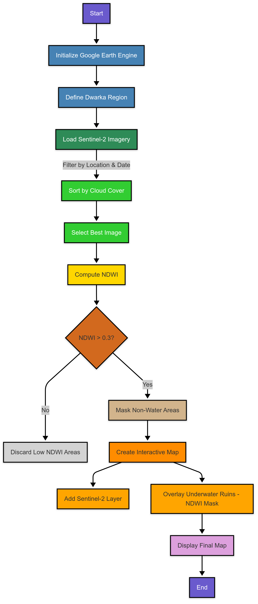

# 🛰️ Unveiling the Lost City: Satellite-based Detection of Underwater Ruins in Dwarka
**Lead Author: Reeva Maulik Kanakhara** | **ORCID: 0009-0009-2029-5065**

## 🔍 Overview
This research explores the use of **Remote Sensing** and **Google Earth Engine (GEE)** to identify potential submerged archaeological features near the coast of Dwarka, Gujarat. This study was presented at the **National Conference on IoT (NCIOT-2025)**.

## 🛠️ Methodology & Tech Stack
* **Platform**: Google Earth Engine (GEE) for cloud-based geospatial analysis.
* **Data Source**: Sentinel-2 Multispectral Imagery.
* **Spectral Analysis**: Normalized Difference Water Index (NDWI) with a threshold of $> 0.3$ to isolate submerged structures.
* **Visualization**: Interactive mapping using `geemap` and `folium`.

## 📖 Publication Details
* **Journal**: Journal of Advanced Research in Computer Graphics and Multimedia Technology.
* **Citation**: Kanakhara R.M., et al. (2025). *Unveiling the lost city: Satellite-based detection of underwater ruins in Dwarka.*

## 🚀 How to Run
1. Open the `DwarkaFinalCode.ipynb` file in this repository.
2. Click the **"Open in Colab"** button at the top of the file.
3. Ensure you have a Google Earth Engine account authenticated to view the interactive layers.

## ⚠️ Publication Note & Corrected Visuals
In the published version of this research, there were labeling errors in the final print regarding Figure 2 and Figure 3. This repository provides the corrected interpretation of the data:

### ✅ Corrected Results Interpretation
* **Fig 2 (Interactive Map)**: Originally labeled as just an interactive map, this interface displays the GEE environment where the parameters were tuned.
* **Fig 3 (Underwater Ruins Layer)**: In the paper, the caption incorrectly identifies this as a "False Negative" or "Incorrectly Classified." **In reality, this is the successful final output**.
* **The Red Mask**: The red clusters clearly identify the submerged architectural formations near the Dwarka coast that passed the NDWI > 0.3 threshold.

### 📊 True Output View

*Above: The actual successful classification of submerged structures, correctly identified by the algorithm.*

### 📊 Workflow

